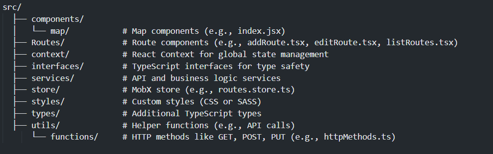

# Waypoints Map Frontend Project

## Project Overview

This is a frontend application for managing routes composed of waypoints, where each waypoint has a position (latitude and longitude) and an ID. Users can:

- Add, edit, and remove routes.
- Edit waypoint positions via text inputs or directly on the map using drag-and-drop.
- Add or delete waypoints.

## Libraries and Technologies Used

- **React**: Frontend framework.
- **TypeScript**: Type safety and development support.
- **MobX**: State management.
- **Leaflet & React-Leaflet**: Mapping library.
- **Leaflet Routing Machine**: Route management on maps.
- **Axios**: HTTP client for making API requests.
- **Material UI (MUI)**: UI component library.
- **Commitizen**: For standardized Git commits.
- **Yarn**: Package manager.
- **Node.js (v20.10.0)**: Runtime environment.

## Project Structure

The project is structured as follows:



## Installation

### Prerequisites:

- Node.js v20.10.0 or higher
- Yarn (recommended)

### Steps to Install and Run:

1. Clone the repository:

   ```bash
   git clone https://github.com/bayoudhali/-waypoints_map_front.git
   cd -waypoints_map_front
   ```

2. Create .env file and copy the content of .env.example in it

3. Install dependencies using Yarn:

```bash
  yarn install
```

4. Start the development server:

```bash
  yarn start
```

Runs the app in the development mode.\
Open [http://localhost:3000](http://localhost:3000) to view it in the browser.

5. Build the project for production:

```bash
  yarn build
```

Builds the app for production to the `build` folder.\
It correctly bundles React in production mode and optimizes the build for the best performance.

The build is minified and the filenames include the hashes.\
Your app is ready to be deployed!

```

```
